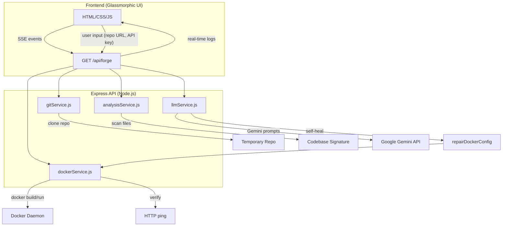

# DockerForge – AI‑Powered Dockerfile Generator & Self‑Healing Agent

> **Generate, build, and verify Docker images from any public GitHub repository** – all in real‑time with a premium, glass‑morphic UI.

---

## 📐 Architecture Overview



**Key components**
- **Frontend** – static `index.html`, `style.css`, `app.js` with Server‑Sent Events for live logs and animated progress steps.
- **Backend** – Express server exposing `/api/forge` SSE endpoint.
- **gitService** – clones a public repo to a temporary directory, cleans up after use.
- **analysisService** – walks the file tree, extracts language signatures and key config files (`package.json`, `requirements.txt`, etc.).
- **llmService** – talks to **Google Gemini** (`gemini-2.5‑flash`) to generate a Dockerfile + optional `docker‑compose.yml`. Also performs the *self‑healing* loop when a build fails.
- **dockerService** – wraps Docker CLI (`docker build`, `docker run`, health‑check ping) and streams logs back to the UI. Includes a sandbox‑simulation fallback for environments where the host Docker daemon is unavailable.

---

## 🛠️ Setup & Run

```powershell
# 1️⃣ Clone the repo (if you don’t already have the workspace)
git clone https://github.com/shekhar-prajapat1/dockerforge.git d:\dockerforge
cd d:\dockerforge

# 2️⃣ Install backend dependencies
cd backend
npm install
cd ..

# 3️⃣ (Optional) Install frontend tooling – the UI is pure static files, so this step is optional
cd frontend
npm install   # only if you plan to add a bundler later
cd ..

# 4️⃣ Configure environment (add your Gemini API key)
notepad .env   # set GEMINI_API_KEY=YOUR_KEY and optionally change PORT

# 5️⃣ Start the server
cd backend
npm run start   # or `node server.js`
```

Open **http://localhost:3000** in a browser, paste a public GitHub repo URL, optionally supply your Gemini API key, and click **Generate & Verify**. The UI will show real‑time cloning, scanning, LLM generation, Docker build attempts, and any self‑healing iterations.

### Docker‑in‑Docker (optional)
If you want to run DockerForge itself inside Docker (useful for CI/CD or isolated environments):
```powershell
# Build the Docker image
docker build -t dockerforge:latest .
# Run, binding the host Docker socket so the container can invoke `docker` commands
docker run -d -p 3000:3000 -v //var/run/docker.sock:/var/run/docker.sock --name dockerforge_container dockerforge:latest
```

---

## 🤖 LLM Provider – Google Gemini

- **Provider:** `gemini-2.5‑flash` (fallback to `gemini-2.0‑flash` → `gemini‑2.5‑pro`).
- **Why Gemini?**
  - State‑of‑the‑art reasoning and code‑generation capabilities, ideal for producing accurate Dockerfile syntax.
  - Low latency and generous free‑tier limits, making the service responsive for interactive UI.
  - Multi‑modal prompt handling (text + JSON) enables us to ask for a strict JSON response, simplifying parsing.
- The fallback chain ensures the system continues operating even if a particular model version is temporarily unavailable.

---

## ⚠️ Known Limitations & Edge Cases

| Limitation | Impact | Mitigation |
|------------|--------|------------|
| **Valid Gemini API key required** | Server will abort generation if the key is missing or invalid. | The UI warns the user; you can also set the key in `.env`.
| **Only public repositories** | Private repos cannot be cloned without additional auth handling. | Future work could add OAuth/GitHub token support.
| **Docker daemon must be reachable** | If Docker is not installed or the daemon is stopped, the backend falls back to a sandbox simulation (logs only). | Install Docker Desktop or run the container with the host socket (`-v /var/run/docker.sock`).
| **Complex multi‑stage builds may need manual tweaks** | LLM may miss obscure build‑time requirements (native libraries, OS‑specific binaries). | Self‑healing loop attempts a fix, but edge‑cases may still require manual intervention.
| **Resource limits on the host** | Very large repos or heavyweight builds can exhaust memory/CPU. | Use the `--max-old-space-size` flag for Node or run DockerForge inside a VM with more resources.
| **Sandbox simulation does not execute real builds** | In sandbox mode the build logs are fabricated – useful for UI testing but not for real verification. | Ensure Docker is running for production use.

---

## 📚 License & Credits

- **License:** MIT – feel free to fork, extend, and ship your own custom version.
- **Core libraries:** Express, simple‑git, @google/generative‑ai, dotenv, cors.
- **Design inspiration:** Glass‑morphic UI trends, modern dark‑mode palettes, and subtle micro‑animations for an immersive user experience.

---

*Happy forging!* 🎉

<!-- Updated on 2026-05-28 -->
